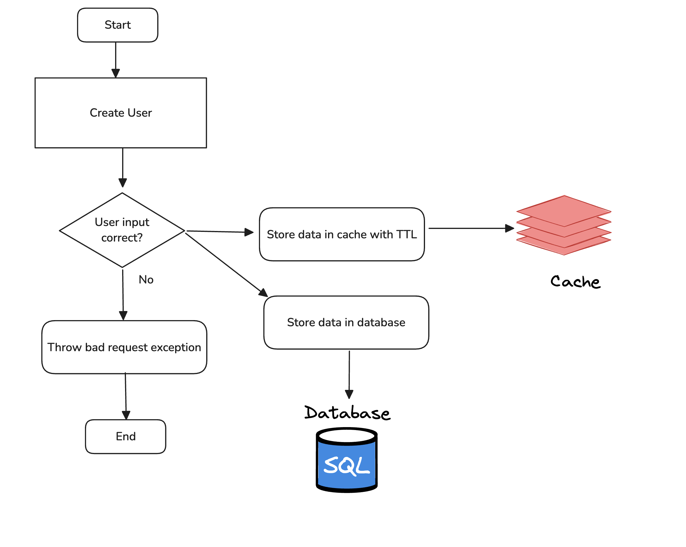
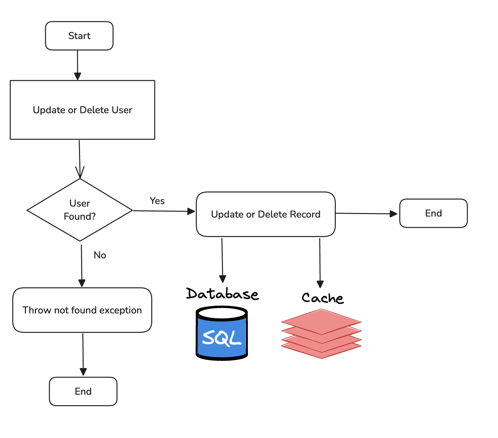
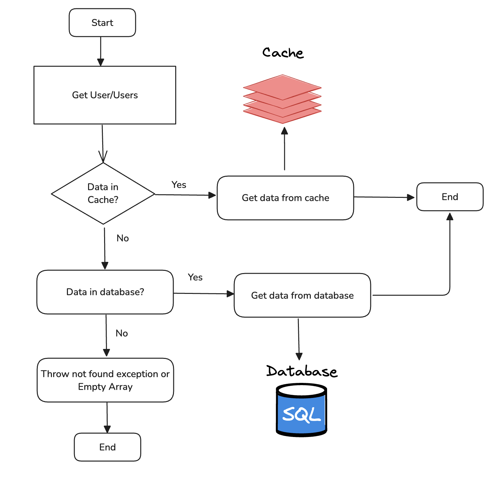
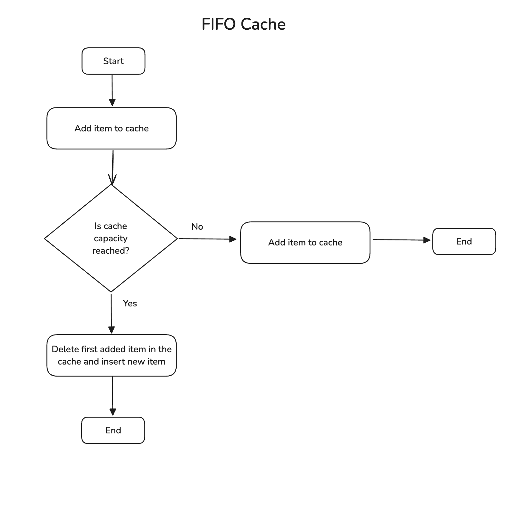
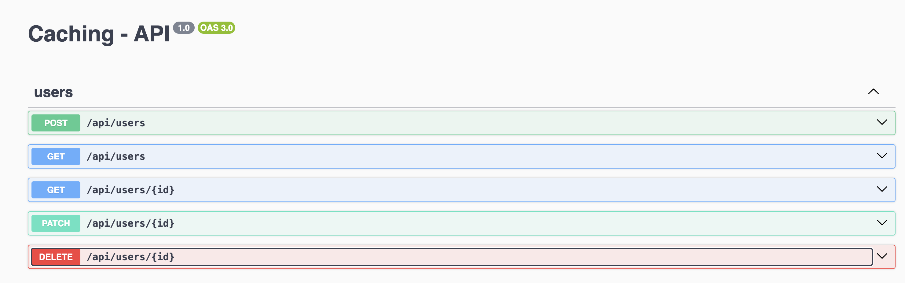
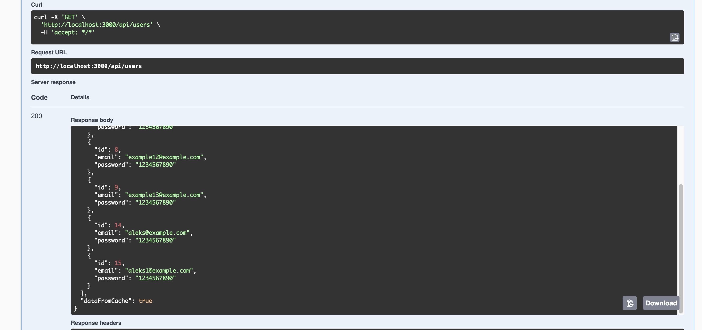
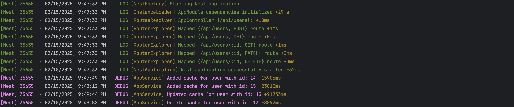

## REST API NestJS with Caching – Example Project
### A fully functional example project built with NestJS, demonstrating how to create a REST API with [Cache-Aside and Write-Through Caching Mechanisms](https://docs.aws.amazon.com/whitepapers/latest/database-caching-strategies-using-redis/caching-patterns.html#:~:text=Cache%2DAside%20(Lazy%20Loading),-A%20cache%2Daside&text=When%20your%20application%20needs%20to,is%20issued%20to%20the%20caller.).

### Project Goal
This project aims to showcase caching mechanisms in the simplest way possible.
It demonstrates Users CRUD API connected to a relational database
while using a Map Data Structure for in-memory caching. 

### Project Caching Examples

The first caching use case is Write-Through.
When a client makes a request to create or update a record through the API,
the new or updated data is stored in both the database and the cache.
The reason for this is to keep the cache valid and in sync with the database,
it is updated whenever the database is updated, preventing outdated or inconsistent data.
(Figure 1.0, 1.1)

Figure 1.0

Figure 1.1

The second caching use case is Cache-Aside.
When a client requests a single user or multiple users, the system first checks the cache for the data.
If the data is available, it is returned immediately; if not,
the system retrieves it from the database and stores it in the cache for future requests.
This approach significantly improves the performance of read operations
since accessing data from memory is much faster than reading from disk-based storage.
(Figure 2.0)

Figure 2.0

When the cache is full, we use a FIFO (First-In, First-Out) eviction policy.
This means the oldest item added to the cache is removed first to make space for new items.
(Figure 3.0)

Figure 3.0

   
# Project installation instructions

1. Clone the project: `git clone git@github.com:alekspetrovv/caching-system-nestjs.git`
2. Install [Postgresql](https://www.postgresql.org/download/) locally
3. Install project dependencies: `npm i`
4. Migrate database: `npx prisma migrate dev --schema src/prisma/schema.prisma`
5. Generate database types: `npx prisma generate --schema src/prisma/schema.prisma`
6. Run project: `npm run start:prod`

# Swagger Documentation

Swagger documentation will be available with the user endpoints to test the caching when api is started:
`localhost:3000/docs`:

The caching will be indicated in the get user/users endpoint with the following response example in the request: 

Furthermore, the application contains logs to indicate if the cache is successfully made or not:

